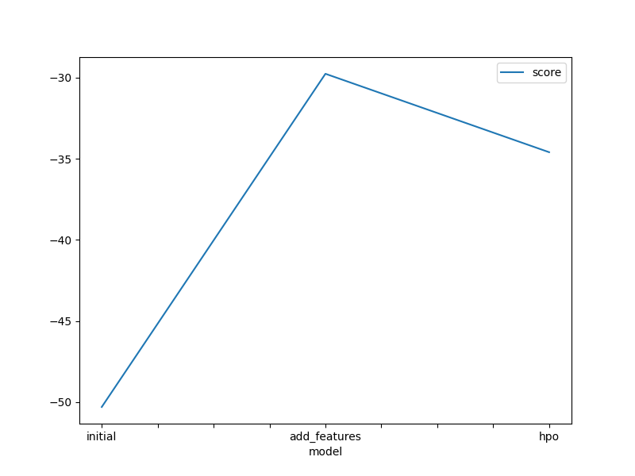
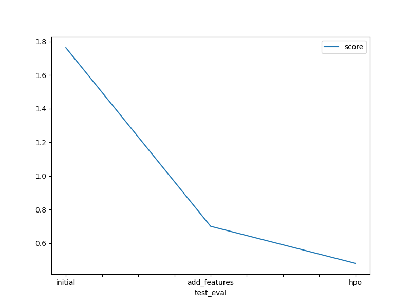

# Report: Predict Bike Sharing Demand with AutoGluon Solution
#### Topister Onyango

## Initial Training
### What did you realize when you tried to submit your predictions? What changes were needed to the output of the predictor to submit your results?
TODO: Add your explanation
When submitting predictions, I needed to adjust the predictor's output format to match the Kaggle competition requirements: a CSV file with two columns for record number and predicted bike counts. Verifying the provided CSV clarified the format needed. Initially unsure about submitting the evaluation command's result, reviewing the CSV clarified the need to submit predictions.

### What was the top ranked model that performed?
TODO: Add your explanation
WeightedEnsemble_L3, which is an ensemble-based model.

## Exploratory data analysis and feature creation
### What did the exploratory analysis find and how did you add additional features?
TODO: Add your explanation
Temp and atemp show high correlation, as do registered and count. There's also correlation among casual-count, casual-registered, atemp/temp-count/casual, and humidity-weather. However, count, registered, casual, and windspeed exhibit low correlation with humidity. Registered, casual, windspeed, and count have left-skewed distributions, while temp and atemp are approximately normal. Season samples are balanced, but holiday and workingday samples are not.

### How much better did your model preform after adding additional features and why do you think that is?
TODO: Add your explanation
It improved from 1.76318 to 0.70002. It helped to have more information available that could be translated into knowledge through the used models.

## Hyper parameter tuning
### How much better did your model preform after trying different hyper parameters?
TODO: Add your explanation
It improved even further, going from 0.70002 to 0.0.47929 in the validation set. This suggests that there may be more potential for improvement.

### If you were given more time with this dataset, where do you think you would spend more time?
TODO: Add your explanation
I'd focus more on cleaning and preprocessing. I'd consider adding new features and performing PCA to eliminate non-contributing ones, standardize features, and possibly rotate axes for better validation. I'd also analyze variables' contributions to the model, removing those with minimal impact to potentially improve model quality.

### Create a table with the models you ran, the hyperparameters modified, and the kaggle score.
|model|hpo1|hpo2|hpo3|score|
|--|--|--|--|--|
|initial|default|default|default|1.76318|
|add_features|default|default|default|0.70002|
|hpo|{'RF': {'criterion': ['squared_error'], 'max_depth': Int: lower=3, upper=30, 'max_features': Real: lower=0.1, upper=1.0, 'max_samples': Real: lower=0.1, upper=1.0}}|{'XGB': {'n_estimators': 100, 'max_depth': Int: lower=3, upper=15, 'learning_rate': Real: lower=0.0001, upper=0.1, 'subsample': Real: lower=0.5, upper=1.0, 'colsample_bytree': Real: lower=0.1, upper=1.0, 'num_boost_round': 100}}|num_stack_levels=2|0.47929|

### Create a line plot showing the top model score for the three (or more) training runs during the project.

TODO: Replace the image below with your own.

### Create a line plot showing the top kaggle score for the three (or more) prediction submissions during the project.

TODO: Replace the image below with your own.

## Summary
TODO: Add your explanation
In this report, I discuss using AutoGluon with the bike rental dataset to predict demand. Adjustments were made to the predictor's output format for Kaggle submission. The top-performing model, WeightedEnsemble_L3, was an ensemble-based model. I enhanced the model with exploratory data analysis, new features (hour, temperature, humidity categories), and hyperparameter optimization. Given more time, I'd focus on cleaning, preprocessing, PCA for feature reduction, and analyzing variable contributions. Overall, these steps led to achieving a Kaggle score of 0.47929.